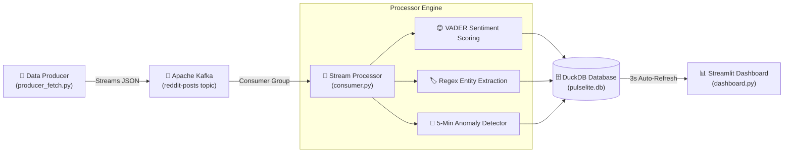

<div align="center">

# 📡 **PulseLite**

### *Real-Time Sentiment & Trend Pulse Engine*

Streamed, scored, and visualized live with Kafka, VADER, DuckDB, and Streamlit.

[](https://www.python.org/)
[](https://kafka.apache.org/)
[](https://duckdb.org/)
[](https://streamlit.io/)
[](https://www.docker.com/)
[](LICENSE)

<br/>

[🎬 Demo & Live Link](#-demo) · [📐 System Architecture](#-system-architecture) · [⚡ Quickstart Guide](#-quickstart-guide) · [🧠 ADRs](#-architecture-decision-records-adrs) · [🗺️ Roadmap](#️-roadmap)

---

</div>

## 🌟 Overview

Brands, communities, and applications need to know what users are expressing **in real-time** — not hours later in a batch ETL process. 

**PulseLite** is an end-to-end real-time streaming telemetry pipeline designed to capture live post feeds, compute instant sentiment analytics, track hashtag volume, detect topic drift, and trigger automatic anomaly alerts on a dynamic live dashboard.

> [!NOTE]
> Built as the core **Streaming Foundation** project for the *Foundations of Data Engineering* internship track (Problem **H3: Real-Time Hashtag Pulse**).

---

## ⚡ Key Features

| Feature | Description |
| :--- | :--- |
| 🔴 **Live Data Streaming** | Real-time social post generator pushing JSON payloads directly to an Apache Kafka topic. |
| 🧠 **VADER Sentiment Scoring** | Fast, rule-based NLP engine assigning compound sentiment scores (-1.0 to +1.0) to incoming posts. |
| 🏷️ **Entity & Hashtag Tagging** | Regex-based extraction identifying trending topics and entity spikes on the fly. |
| 📈 **Minute-Granularity Metrics** | Aggregates volume per minute, tracks rolling sentiment averages, and monitors topic drift. |
| 🚨 **Automated Anomaly Alerts** | Rolling 5-minute window anomaly detector flagging volume spikes ($>3\times$ baseline average). |
| ⚡ **Zero-Ops Analytics Sink** | High-throughput, concurrent writes and reads powered by embedded DuckDB storage. |
| 📊 **Self-Refreshing Dashboard** | Streamlit web UI auto-updating every 3 seconds with interactive Plotly visualizations. |

---

## 🎬 Demo

> [!TIP]
> Try out the live hosted dashboard or watch the full video walkthrough below!

| Asset | Link |
| :--- | :--- |
| 🌐 **Live Hosted Dashboard** |https://pulselite-9j5srszefmrgmff3rx8dn3.streamlit.app/ |
| 🎥 **Loom Video Walkthrough** | [Watch on LinkedIn Post](https://www.linkedin.com/posts/madhav-sathyan-944b3733a_dataengineering-kafka-streaming-ugcPost-7485765426162040832-rLUS/) |

---

## 📐 System Architecture



### Component Breakdown

1. **`producer_fetch.py`**: Simulates realistic, multi-topic social posts (Reddit-compatible schema) and pushes messages to Kafka at configurable rates.
2. **Apache Kafka & ZooKeeper**: Containerized event broker managing stream buffers and consumer subscriptions.
3. **`consumer.py`**: Multi-stage consumer performing real-time sentiment scoring, hashtag/entity extraction, topic drift calculation, and anomaly detection. Writes clean datasets to DuckDB.
4. **`pulselite.db` (DuckDB)**: Embedded analytical store optimized for concurrent writes from the consumer and low-latency queries from the dashboard.
5. **`dashboard.py`**: Streamlit application providing live metric cards, sentiment distributions, topic volume timelines, and highlighted anomaly logs.

---

## 🛠️ Tech Stack & Design Choices

| Layer | Component | Technical Justification |
| :--- | :--- | :--- |
| **Ingestion** | `Python` (Simulated Generator) | Eliminates external API rate limits while maintaining schema realistic to production feeds. |
| **Message Broker** | `Apache Kafka` | De-facto industry standard for distributed event streaming and message queuing. |
| **NLP Engine** | `VADER` | Extremely lightweight, sub-millisecond execution tuned specifically for social media micro-text. |
| **Storage Sink** | `DuckDB` | Embedded OLAP engine providing serverless, zero-maintenance, file-based column store performance. |
| **Visualization** | `Streamlit` + `Plotly` | Reactive UI framework enabling auto-refreshing charts and rapid prototyping. |
| **Infrastructure** | `Docker Compose` | Single-command orchestration for ZooKeeper, Kafka, Producer, Consumer, and Dashboard services. |

---

## 📁 Repository Structure

```directory
PulseLite/
├── 📄 docker-compose.yml     # Multi-container orchestration (Kafka, ZooKeeper, App services)
├── 📄 Dockerfile             # Container definition for pipeline components
├── 📄 producer_fetch.py      # Kafka producer generating synthetic live post streams
├── 📄 consumer.py            # Stream consumer, VADER engine, anomaly detector & DuckDB writer
├── 📄 dashboard.py           # Streamlit live telemetry dashboard interface
├── 📄 requirements.txt       # Python dependencies (duckdb, streamlit, nltk, kafka-python, etc.)
├── 📄 pulselite.db           # Bundled DuckDB snapshot for standalone demo mode
├── 📁 docs/                  # Architecture Decision Records (ADRs)
│   ├── 📄 ADR-01-data-source.md
│   ├── 📄 ADR-02-duckdb-connections.md
│   ├── 📄 ADR-03-vader-sentiment.md
│   └── 📄 ADR-04-duckdb-concurrency-fix.md
└── 📁 .streamlit/            # Streamlit theme and configuration
```

---

## ⚡ Quickstart Guide

### Prerequisites
- 🐳 **Docker & Docker Compose** (Recommended)
- 🐍 **Python 3.10+** (Required for local installation)

---

### Option 1: Full Streaming Pipeline (Docker Compose) 🚀

To run the complete end-to-end pipeline with Kafka, consumer, and live auto-refreshing UI:

```bash
# 1. Clone repository
git clone https://github.com/madhavsathyan/PulseLite.git
cd PulseLite

# 2. Launch the entire containerized stack
docker compose up -d
```

Access the live dashboard at: **`http://localhost:8501`**

---

### Option 2: Local Development Setup 🐍

Run the services directly on your host machine:

#### 1. Setup Virtual Environment
```bash
python -m venv venv

# On Windows (PowerShell):
.\venv\Scripts\activate

# On macOS / Linux:
source venv/bin/activate

pip install -r requirements.txt
```

#### 2. Start Infrastructure & Pipelines
```bash
# Terminal 1: Spin up Kafka & Zookeeper containers
docker compose up -d zookeeper kafka

# Terminal 2: Start data streaming producer
python producer_fetch.py

# Terminal 3: Start consumer & stream processor
python consumer.py

# Terminal 4: Start interactive dashboard
streamlit run dashboard.py
```

---

### Option 3: Standalone Demo Mode (Zero-Docker) 📸

> [!IMPORTANT]
> Want to explore the dashboard immediately without starting Docker or Kafka? You can launch Streamlit using the bundled `pulselite.db` snapshot.

```bash
pip install -r requirements.txt
streamlit run dashboard.py
```

---

## 🚨 Anomaly Detection Algorithm

PulseLite implements a **sliding-window statistical anomaly detector**:

1. Calculates a rolling **5-minute baseline volume average** per topic ($V_{\text{avg}}$).
2. Monitors current 1-minute post arrival rate ($V_{\text{current}}$).
3. If $V_{\text{current}} \ge 3 \times V_{\text{avg}}$, an **anomaly alert** is triggered.
4. Alerts write immediately to DuckDB and display as highlighted alert cards on the dashboard log.

> [!NOTE]
> **Why this matters:** Real-time spike detection is a foundational pattern in streaming telemetry, useful for cyber threat detection, breaking news tracking, and outage monitoring.

---

## 🧠 Architecture Decision Records (ADRs)

Key architectural choices documented during development:

| ADR | Title | Decision Summary |
| :--- | :--- | :--- |
| [**ADR-01**](docs/ADR-01-data-source.md) | **Synthetic Data Generator** | Selected synthetic feed over Reddit API to avoid strict developer rate limits and token approval delays. |
| [**ADR-02**](docs/ADR-02-duckdb-connections.md) | **Per-Write Connection Pattern** | Designed lightweight per-write connection lifecycles to maintain thread safety across concurrent workers. |
| [**ADR-03**](docs/ADR-03-vader-sentiment.md) | **VADER NLP Classifier** | Chosen over heavy LLM/Transformers for zero latency overhead and lightweight CPU inference. |
| [**ADR-04**](docs/ADR-04-duckdb-concurrency-fix.md) | **Concurrency Lock Management** | Implemented retry logic & read-only connections to prevent DuckDB database locks between consumer & UI. |

---
💼 Resume Bullets

- Built PulseLite, a real-time streaming pipeline processing social media
  posts through Kafka, with VADER sentiment scoring, regex-based entity
  extraction, rolling topic-drift detection, and volume anomaly alerts

- Designed and containerized a 5-service pipeline (Kafka, Zookeeper,
  producer, consumer, dashboard) with Docker Compose; diagnosed and
  resolved a DuckDB concurrency bug causing consumer crash-loops via
  connection-lifecycle management and retry-with-backoff logic

- Documented 4 Architecture Decision Records covering data-source
  tradeoffs, database concurrency, and model selection, and deployed a
  live public demo on Streamlit Cloud

## ⚠️ Current Limitations & 🗺️ Roadmap

| Category | Current State | Planned Production Extension |
| :--- | :--- | :--- |
| **Delivery Guarantee** | At-least-once delivery | End-to-end **Exactly-once** processing semantics |
| **Watermarking** | Arrival time processing | Event-time windowing with **late-data handling** |
| **Stream Joins** | Single stream processing | **Stream-stream joins** across user clickstreams |
| **Engine** | Python Kafka Consumer | Migration to **Apache Flink / Spark Streaming** |
| **Alerting** | Fixed $3\times$ static threshold | Adaptive **Z-score / EWMA** statistical models |

---

## 📄 License & Credits

- **License**: Released under the **[MIT License](LICENSE)**.
- **Author**: Created by **Madhav Sathyan** as part of the *Foundations of Data Engineering* internship track.
- **Problem Statement**: **H3: Real-Time Hashtag Pulse**.

---
🙏 Acknowledgements
TrendWatch (fictional client scenario) — internship problem framework
Apache Kafka, DuckDB, Streamlit — open-source tools that made this possible
Internship mentor — for guidance through every debugging session, especially the DuckDB concurrency saga

---
<div align="center">
  <sub>Built with ❤️ using Python, Apache Kafka, DuckDB & Streamlit</sub>
</div>
